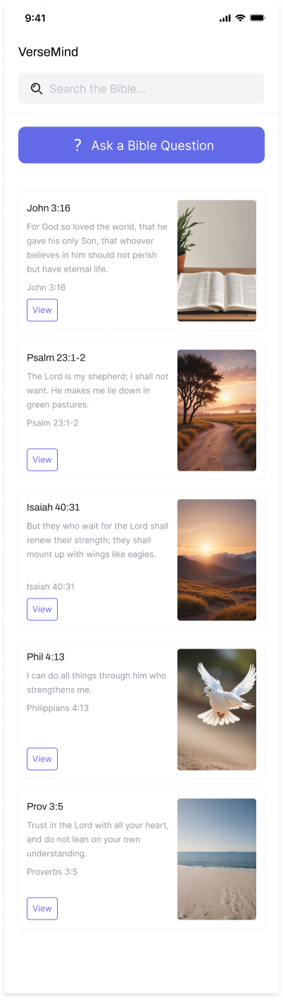
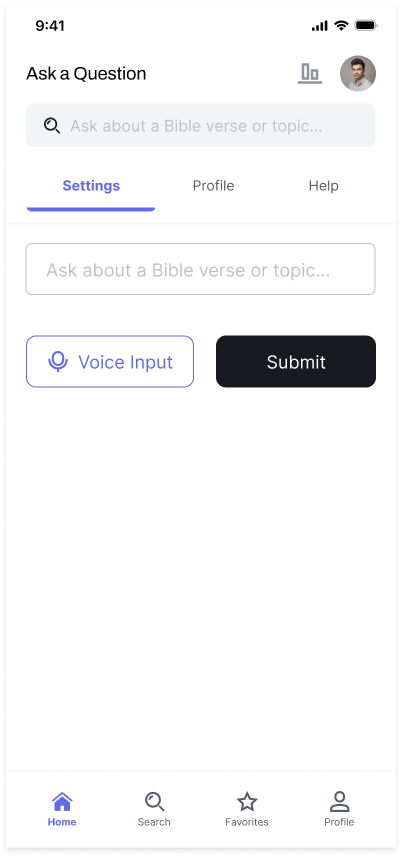
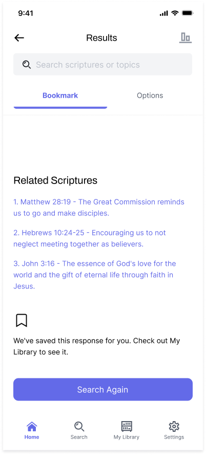
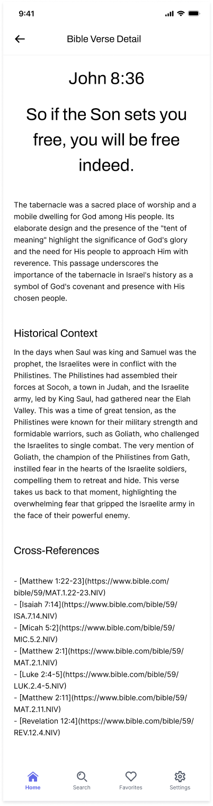
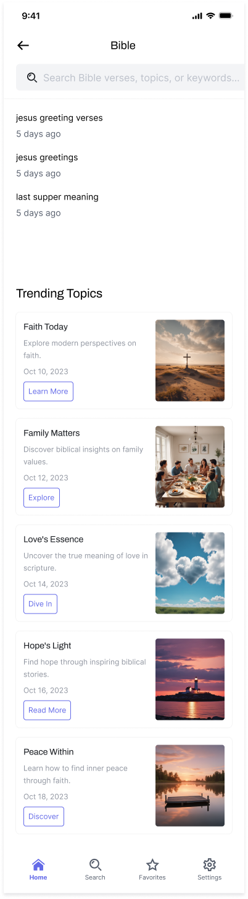
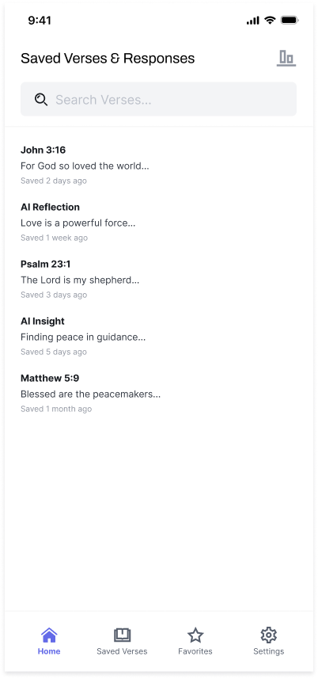
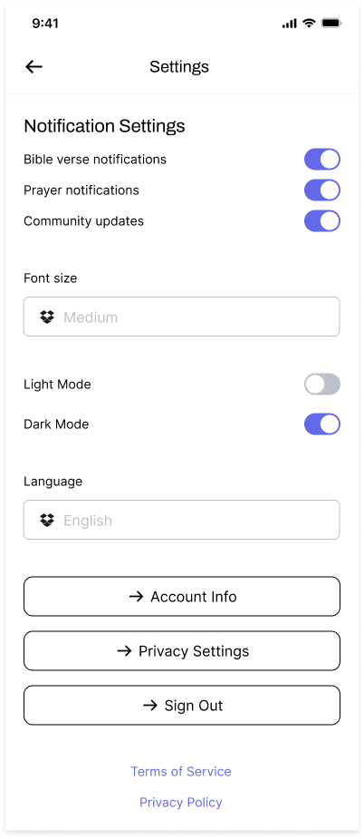
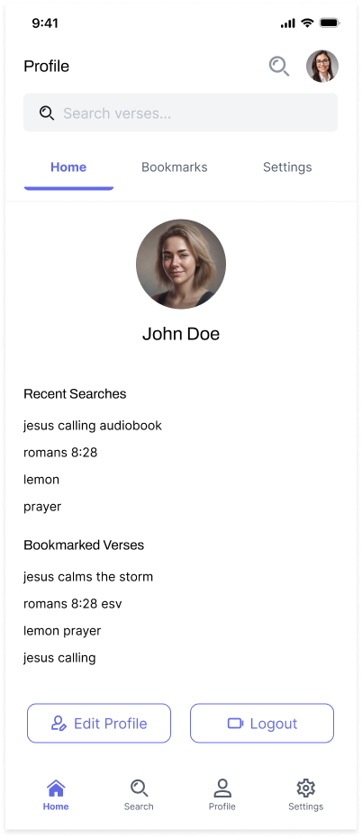
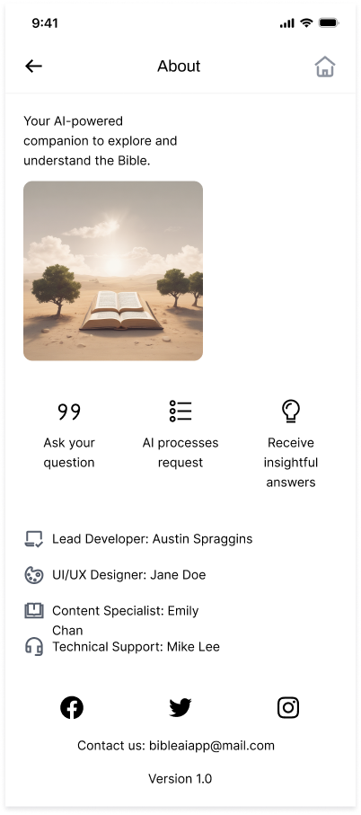
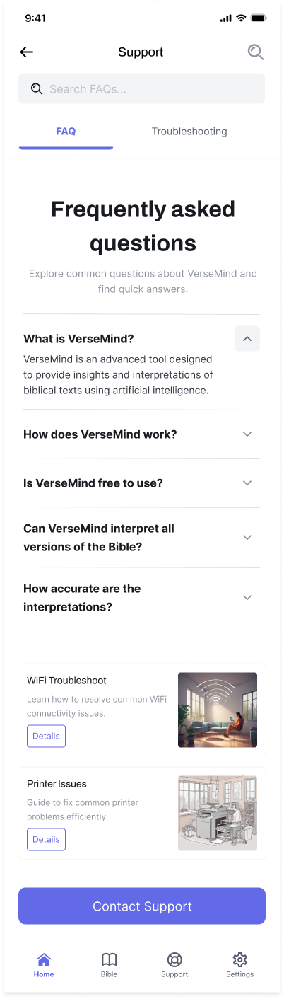

## 📱 UI Designs  

The following UI screens were designed with the main aim of improving user experience and represent the core user experience of the VerseMind AI Mobile App.  

### 🔹 Home Screen  
  

### 🔹 Question Input  
  

### 🔹 AI Response Display  
  

### 🔹 Verse Details  
  

### 🔹 Search Functionality  
  

### 🔹 Favorites/Bookmarks  
  

### 🔹 Settings  
  

### 🔹 User Profile  
  

### 🔹 About/Information  
  

### 🔹 Help/Support  
  

---

## 📥 How to Access Designs  

1. Navigate to the **`designs/`** folder in this repository.  
2. Open the **Figma project link**: [View Designs on Figma](<https://www.figma.com/design/X4wIW88MuLA4hEAlFzf4lX/VerseMind?node-id=2-1199&t=NYpJGuNDHoCl76Ty-1>)  
3. Review the UI screens and provide feedback.  

---

## 🚀 Next Steps  
- Implement these designs in **React Native**.
- Integrate API calls for VerseMind-related AI responses.  
- Enhance the user experience with smooth animations and navigation.  

